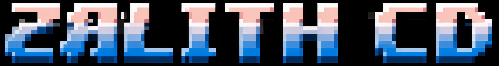

    </img>

<h1 align="center">Revived </h1>

---

### 🚀 Preserving the Roots, Built for the Future

**Zalith CD (Community Development)** is an open-source, community-driven revival and continuation of the original, abandoned Zalith Launcher.

- Please note I am just learning.

Zalith Launcher is a Minecraft mobile utility based on [PojavLauncher](https://github.com/PojavLauncherTeam/PojavLauncher) that runs [Minecraft: Java Edition](https://www.minecraft.net/) on Android devices. It originally set out to lower the barrier to entry for mobile players by redesigning the interface and adding highly practical, built-in features.

Now under active community development, the mission is simple: **preserve the classic foundation while refining it for modern devices.** As an active member of the mobile Minecraft community, this project is built from the ground up based directly on what real players want, need, and experience every day.

> [!NOTE]
> This project is an independent **community remake and revival**. It is no longer associated with any old legacy websites or the original, now-inactive development teams. 

---

<h2 align="center">Core Features</h2>

- **Clean UI & Usability:** Refactored layout designed for aesthetics and smooth navigation.
- **Built-in File Manager:** Access game files directly without fighting restrictive Android scoped storage permissions!
- **Simple Game Storage:** Custom game directory paths, allowing configurations on external storage.
- **Renderer Extension:** Support for multiple renderers and renderer plugins.
- **In-App Downloads:** Grab Mods, ModPacks, resource packs, world saves, and shader packs directly within the client.
- **Deep Customization:** Fully customizable virtual mouse layouts, custom background scaling, and native Light/Dark themes.

---

<h2 align="center">Screenshots</h2>

    
<em>Check the <code>.github/images/</code> folder to view UI previews.</em>

---

<h2 align="center">License</h2>

- **Zalith CD** remains strictly open source under the **GNU GPL v3** license.

---

<h2 align="center">Special Thanks & Lineage</h2>

This continuation stands on the shoulders of incredible upstream open source projects and libraries. 

#### Code Libraries Inherited from PojavLauncher

>- [Boardwalk](https://github.com/zhuowei/Boardwalk) (JVM Launcher): Unknown license / [Apache License 2.0](https://github.com/zhuowei/Boardwalk/blob/master/LICENSE) or GNU GPLv2.
>- Android Support Library: [Apache License 2.0](https://android.googlesource.com/platform/prebuilts/maven_repo/android/+/master/NOTICE.txt).
>- [GL4ES](https://github.com/PojavLauncherTeam/gl4es): [MIT License](https://github.com/ptitSeb/gl4es/blob/master/LICENSE).
>- [OpenJDK](https://github.com/PojavLauncherTeam/openjdk-multiarch-jdk8u): [GNU GPLv2 License](https://openjdk.java.net/legal/gplv2+ce.html).
>- [LWJGL3](https://github.com/PojavLauncherTeam/lwjgl3): [BSD-3 License](https://github.com/LWJGL/lwjgl3/blob/master/LICENSE.md).
>- [LWJGLX](https://github.com/PojavLauncherTeam/lwjglx) (LWJGL2 API compatibility layer for LWJGL3): Unknown license.
>- [Mesa 3D Graphics Library](https://gitlab.freedesktop.org/mesa/mesa): [MIT License](https://docs.mesa3d.org/license.html).
>- [pro-grade](https://github.com/pro-grade/pro-grade) (Java Sandbox Security Manager): [Apache License 2.0](https://github.com/pro-grade/pro-grade/blob/master/LICENSE.txt).
>- [bhook](https://github.com/bytedance/bhook) (For exit code capture): [MIT License](https://github.com/bytedance/bhook/blob/main/LICENSE).
>- [libepoxy](https://github.com/anholt/libepoxy): [MIT License](https://github.com/anholt/libepoxy/blob/master/COPYING).
>- [virglrenderer](https://github.com/PojavLauncherTeam/virglrenderer): [MIT License](https://gitlab.freedesktop.org/virgl/virglrenderer/-/blob/master/COPYING).

#### Additional Upstream Credits

>- [HMCL](https://github.com/HMCL-dev/HMCL) (Shared logic source code): [GPL-3.0 License](https://github.com/HMCL-dev/HMCL/blob/main/LICENSE)
>- [CommonMark](https://github.com/thephpleague/commonmark) (Markdown text rendering): [BSD-3-Clause License](https://github.com/thephpleague/commonmark/blob/2.5/LICENSE)
>- [AndroidViewAnimations](https://github.com/daimajia/AndroidViewAnimations) (UI animation core elements): [MIT License](https://github.com/daimajia/AndroidViewAnimations/blob/master/License)
>- [TapTargetView](https://github.com/KeepSafe/TapTargetView) (In-app UX onboarding guides): [Apache License 2.0](https://github.com/KeepSafe/TapTargetView/blob/master/LICENSE)
